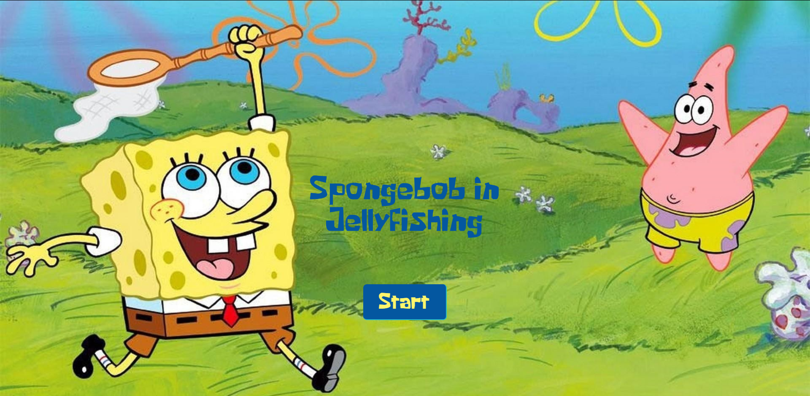
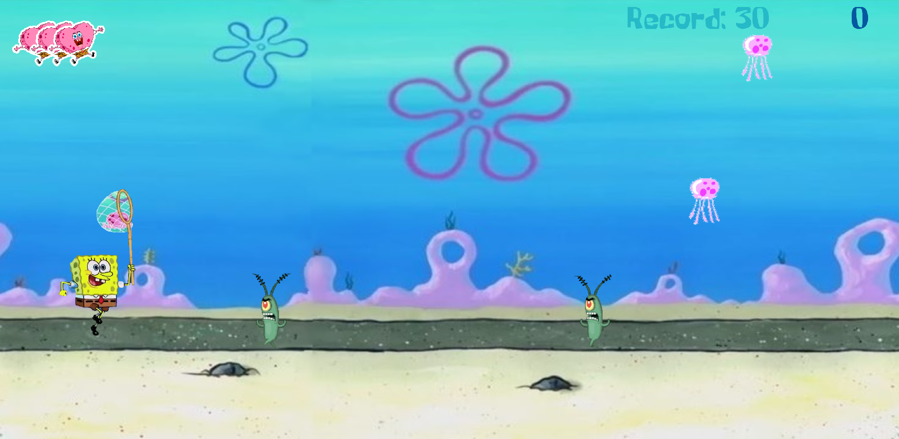

## About

This project was develop in [Imersão Game Dev from Alura](https://www.alura.com.br/imersao-gamedev-javascript).

I have develop in my local using the p5.js lib, Node and Browser-sync, instead of using the p5.js editor in the browser.

To run it, install Node, [Browser-sync](https://browsersync.io/) and use:

```
browser-sync start -server -f -w
```



